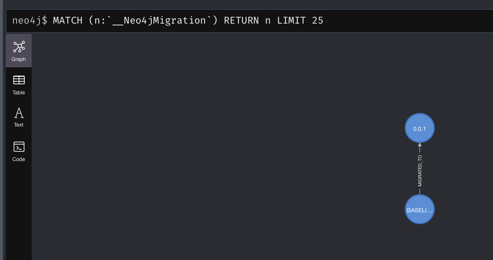
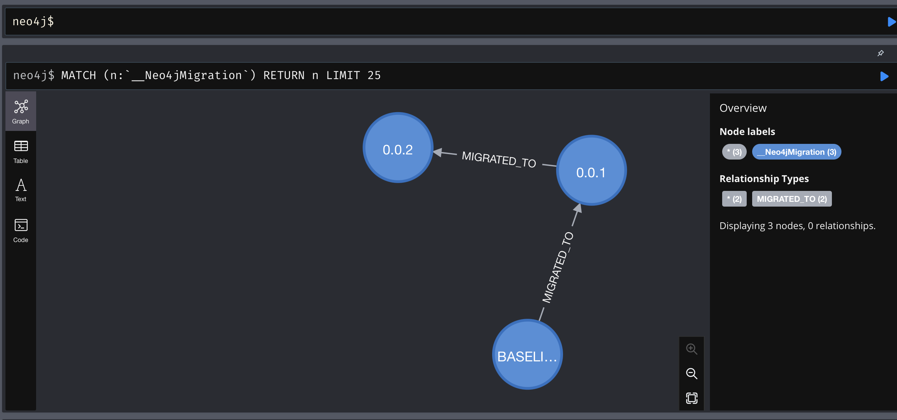

# Neo4j-Mirgations

## Installation

Install SDKMan

```sh
curl -s "https://get.sdkman.io" | bash
source "$HOME/.sdkman/bin/sdkman-init.sh"
sdk version
```

Install Neo4j-Migration from SDKMan

```sh
sdk install neo4jmigrations
```

## Init Neo4j-Migrations in current directory

This command will create a project Neo4j-Migrations project with a configuration file named `.migrations.properties` and a folder to store cypher migration scripts `./neo4j/migrations`

```sh
neo4j-migrations init
```

To test Neo4j-Migrations create a sample Cypher files in the `./neo4j/migrations` folder named `V0_0_1__ASPIS4J_Migration.cypher` with the following code

```sql
// assert that edition is community
// assert that version is ge 4.4
CREATE (agent:`007`) RETURN agent;
UNWIND RANGE(1,6) AS i
WITH i CREATE (n:OtherAgents {idx: '00' + i})
RETURN n
;
```

Check if Neo4-Migrations is reading connecting to Neo4j DB

```sh
neo4j-migrations --password:env NEO4J_PASSWORD info mode=REMOTE
```
The output should be like this

```sh
neo4j@localhost:7687 (Neo4j/4.4.5)
Database: neo4j


No migrations found.
```

Check if Neo4-Migrations is reading the local Cypher migration file

```sh
neo4j-migrations --password:env NEO4J_PASSWORD info mode=LOCAL
```

The output should be like this

```sh

neo4j@localhost:7687 (Neo4j/4.4.5)
Database: neo4j

+---------+-------------------+--------+--------------+----+----------------+---------+----------------------------------+
| Version | Description       | Type   | Installed on | by | Execution time | State   | Source                           |
+---------+-------------------+--------+--------------+----+----------------+---------+----------------------------------+
| 0.0.1   | ASPIS4J Migration | CYPHER |              |    |                | PENDING | V0_0_1__ASPIS4J_Migration.cypher |
+---------+-------------------+--------+--------------+----+----------------+---------+----------------------------------+
```

To perform the first migration

```sh
neo4j-migrations --password:env NEO4J_PASSWORD migrate
```

The output should be like this

```sh
Applied migration 0.0.1 ("ASPIS4J Migration").
Database migrated to version 0.0.1.
```

And now we can check the new migration status

```sh
neo4j-migrations --password:env NEO4J_PASSWORD info
```

And the new output should be

```sh
neo4j@localhost:7687 (Neo4j/4.4.5)
Database: neo4j

+---------+-------------------+--------+-------------------------------+------------------+----------------+---------+----------------------------------+
| Version | Description       | Type   | Installed on                  | by               | Execution time | State   | Source                           |
+---------+-------------------+--------+-------------------------------+------------------+----------------+---------+----------------------------------+
| 0.0.1   | ASPIS4J Migration | CYPHER | 2022-04-15T20:48:38.476Z[UTC] | jjaramillo/neo4j | PT0.138S       | APPLIED | V0_0_1__ASPIS4J_Migration.cypher |
+---------+-------------------+--------+-------------------------------+------------------+----------------+---------+----------------------------------+

```

Now the Neo4j DB should have the chain of migrations like this:

.

Now create a second migration to remove staff from first migration. Create a file `V0_0_2__Remove_agents.cypher`  in `./neo4j/migrations` folder with the following code:

```sql
// assert that edition is community
// assert that version is ge 4.4
MATCH (agent:`007`) 
DETACH DELETE agent;
MATCH (n:OtherAgents)
DETACH DELETE n;
```

And then check migration status

```sh
neo4j-migrations --password:env NEO4J_PASSWORD info
```

and the output should be:

```sh
neo4j@localhost:7687 (Neo4j/4.4.5)
Database: neo4j

+---------+-------------------+--------+-------------------------------+------------------+----------------+---------+----------------------------------+
| Version | Description       | Type   | Installed on                  | by               | Execution time | State   | Source                           |
+---------+-------------------+--------+-------------------------------+------------------+----------------+---------+----------------------------------+
| 0.0.1   | ASPIS4J Migration | CYPHER | 2022-04-15T20:48:38.476Z[UTC] | jjaramillo/neo4j | PT0.138S       | APPLIED | V0_0_1__ASPIS4J_Migration.cypher |
| 0.0.2   | Remove agents     | CYPHER |                               |                  |                | PENDING | V0_0_2__Remove_agents.cypher     |
+---------+-------------------+--------+-------------------------------+------------------+----------------+---------+----------------------------------+
```

Now perform the second migration:

```sh
neo4j-migrations --password:env NEO4J_PASSWORD migrate
```

Outout should be

```sh
Skipping already applied migration 0.0.1 ("ASPIS4J Migration")
Applied migration 0.0.2 ("Remove agents").
Database migrated to version 0.0.2.
```

Check status

```sh
neo4j-migrations --password:env NEO4J_PASSWORD info
```

```sh

neo4j@localhost:7687 (Neo4j/4.4.5)
Database: neo4j

+---------+-------------------+--------+-------------------------------+------------------+----------------+---------+----------------------------------+
| Version | Description       | Type   | Installed on                  | by               | Execution time | State   | Source                           |
+---------+-------------------+--------+-------------------------------+------------------+----------------+---------+----------------------------------+
| 0.0.1   | ASPIS4J Migration | CYPHER | 2022-04-15T20:48:38.476Z[UTC] | jjaramillo/neo4j | PT0.138S       | APPLIED | V0_0_1__ASPIS4J_Migration.cypher |
| 0.0.2   | Remove agents     | CYPHER | 2022-04-15T21:22:44.789Z[UTC] | jjaramillo/neo4j | PT0.048S       | APPLIED | V0_0_2__Remove_agents.cypher     |
+---------+-------------------+--------+-------------------------------+------------------+----------------+---------+----------------------------------+
```

and the migration chain should be like:

.

